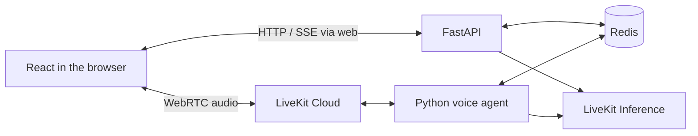

# Workplace English Coach

Practice the conversations you have at work. Talk with Alex through short workplace scenarios, get feedback on your wording and tone, and try one improvement in a follow-up.

Built with **React, TypeScript, FastAPI, LiveKit, and Redis** for intermediate English learners (B1–B2).

[Watch the demo — 3:22](demo/walkthrough.mp4) · [Run locally](#run-locally) · [Engineering notes](docs/engineering.md) · [How I built it](workflow.md)

[](demo/walkthrough.mp4)

The demo uses scripted synthetic learner speech. Alex's replies, transcripts, and coaching are generated by the running application. See the [walkthrough guide](demo/README.md) for the flow and recording details.

## What you can do

- **Practice a specific situation.** Choose from nine purposes across meetings, one-on-ones, and casual conversation. Hear useful expressions before starting.
- **Speak in your own words.** Alex opens the conversation and responds to your answers. After two or three answers, the exchange moves into coaching.
- **Get feedback you can act on.** Coaching uses quotes from your answers to explain naturalness and workplace tone, then suggests one thing to try.
- **Try again and revisit feedback.** A focused retry gives you another attempt at that suggestion. Recent sessions lets the same browser resume practice or review feedback without an account.

## How it works

Four services run in Docker Compose. LiveKit Cloud carries the audio, and LiveKit Inference provides transcription, language models, and speech synthesis.



- **`web`** serves the React interface and proxies API requests. The browser connects directly to LiveKit for audio.
- **`api`** handles guest identity, session commands, history, room dispatch, and speech for examples and saved review.
- **`agent`** runs the conversation and assessments. It uses Deepgram for transcription, Gemini for replies and feedback, and Cartesia for speech.
- **`redis`** holds session state, accepted answers, ownership, and assessment results. Both backend processes use the same session rules.

The [engineering notes](docs/engineering.md) explain the boundaries and link to the relevant code.

## Engineering decisions

- **Keep session rules in code.** The model proposes replies and feedback; code validates them and decides when the session advances. Redis transactions, ownership checks, and command IDs protect against repeated requests and competing tabs. This takes more code, but makes recovery predictable.
- **Ground feedback in what the learner said.** A separate assessment request evaluates Naturalness and Workplace tone, with supporting quotes checked against accepted answers. Transcripts make the evidence inspectable, but cannot support pronunciation or vocal-delivery scores.
- **Trade some speed for speech continuity.** The app prepares a complete reply before playback so gaps between incoming speech chunks don't reach the listener. This adds waiting time. Alex and the learner take turns speaking; Pause and Finish can stop playback, but spoken interruption isn't supported.

## Run locally

You'll need Docker with Compose, an internet connection, and a **LiveKit Cloud project with Inference access and available credits**. Python and Node aren't needed for the containerized app.

1. Copy [`.env.example`](.env.example) to `.env` in the repository root.
2. Set `LIVEKIT_URL`, `LIVEKIT_API_KEY`, `LIVEKIT_API_SECRET`, and `GUEST_COOKIE_SECRET`. Generate the cookie secret and paste it into `.env`:

   ```sh
   docker run --rm python:3.12.12-slim-bookworm python -c "import secrets; print(secrets.token_hex(32))"
   ```

3. Build and start the app:

   ```sh
   docker compose up --build -d
   docker compose ps
   ```

4. Open [localhost:8080](http://localhost:8080), choose a situation, and select **Start practice**. Allow microphone access and wait for **Your turn** before speaking. Headphones help avoid echo.

Compose reads the root `.env`. All model calls use LiveKit Inference; separate model-provider keys aren't needed. The first build downloads dependencies and model assets.

The [development guide](docs/development.md) covers provider checks, logs, ports, phone access, tests, and shutdown.

## Validation and current limits

Recorded checks from September 27, 2026 include:

- Docker Compose startup with all four services healthy.
- 63 backend tests, 9 frontend tests, 6 browser tests, and the frontend production build passing.
- Real provider calls and a WebRTC journey through practice, coaching, and saved review.
- A speech-content check of the walkthrough, including tutor sentence endings.

See the [verification record](docs/verification/workplace-english-release-checks.md) for the scope and evidence. These are results from those runs, not a continuously updated build status.

- **History is temporary.** Sessions expire within 24 hours of eligible practice activity. Restarting Redis loses saved history.
- **Evaluation is still limited.** Coaching quality across accents, physical microphones, echo, and response-latency percentiles need further evaluation. The demo uses synthetic learner speech.
- **Capacity is small.** The default is four active voice sessions. The project has no large-scale load-test result.

To work toward **10,000 concurrent sessions**, I would separate API, voice, and assessment workers; remove the shared Redis admission bottleneck; replace polling with notifications; and measure provider capacity, latency, and recovery under load. The [scaling plan](docs/engineering.md#scaling-to-10000-concurrent-sessions) explains those proposed changes.

## Project documentation

- [Development guide](docs/development.md): setup details and test commands.
- [Engineering notes](docs/engineering.md): architecture, tradeoffs, data handling, and scaling.
- [AI workflow](workflow.md): tools, models, decisions, and the build process.
- [Documentation index](docs/README.md): product and technical specifications, planning, and investigation notes.

This project began as a take-home exercise. The [original brief](PROMPT.md) and development history are retained for context; the README describes the current application.
