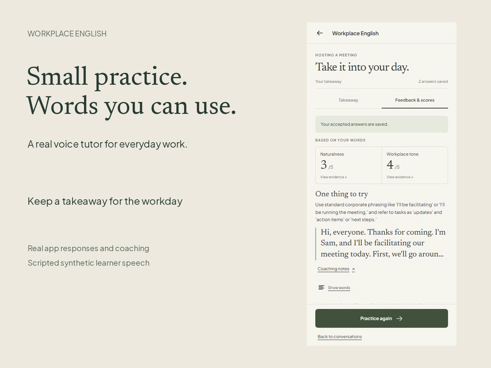

# Walkthrough

[Watch the 3:22 demo](walkthrough.mp4) of Workplace English Coach.

## What the video shows

- Practice **Hosting a meeting → Welcome everyone** with Alex.
- Answer an opening question and a follow-up in your own words.
- Hear coaching and see feedback on Naturalness and Workplace tone.
- Finish practice and reopen the saved feedback without microphone access.

The learner uses scripted synthetic speech. Alex's replies, transcripts, and coaching are generated by the running app. No personal learner recording is used. Dialogue and waiting time are preserved, and playback isn't sped up. A focused retry is available in the app but isn't shown in this recording.

The preview shows saved feedback from the recorded app. Detailed audio and recording checks are in the [verification notes](../docs/verification/workplace-english-release-checks.md#walkthrough-audio-correction).

## Try the flow yourself

1. Start the app using the [Docker quickstart](../README.md#run-locally).
2. Choose **Hosting a meeting → Welcome everyone**, read the situation, and start practice.
3. Let Alex finish. When **Your turn** appears, welcome the group in your own words.
4. Answer the next question, then listen to the coaching and inspect **Based on your words**.
5. Optionally try the suggestion in a focused retry.
6. Finish practice and reopen the saved feedback.

## What to expect

- Alex prepares complete replies before playback, which adds waiting time.
- Temporary history expires within 24 hours of eligible practice activity and is lost when Redis restarts.
- Coaching quality, physical microphones, and echo behavior still need broader evaluation.

See the [engineering notes](../docs/engineering.md) for the design tradeoffs and the [development guide](../docs/development.md) to run automated checks.
