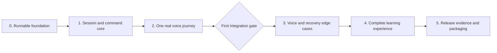

# Workplace English tutor — implementation plan

Date: 2026-09-26

Status: **Approved for execution on 2026-09-26.** The user agreed to the implementation order and early review of one working voice journey. Execute milestones 0–2 first, then review that checkpoint before expanding the interface. The full agreed MVP remains the delivery target. No live-model result is implied by plan approval.

**Execution update, 2026-09-26:** after the milestone 2 checkpoint, the user authorized proceeding through **milestone 4**. The current implementation and verification are recorded in the [milestone 4 checkpoint](workplace-english-milestone-4-checkpoint.md), including unresolved audio-delivery and inferred-continuation timing limits. Stop before milestone 5; release evidence and submission packaging are not complete.

**Demo scope update, 2026-09-27:** the user approved freezing features and completing the submission essentials plus a desktop demo rehearsal. Complete the clean-checkout Compose verification, required documentation, exact-source `PROMPT.md`, recorded walkthrough, and inspected repository ZIP. Defer the broader human/scoring evaluation, physical-phone matrix, and statistical latency programme. This revises the current delivery target to a take-home demo; it does not claim all full-release acceptance gates pass. Results are recorded in [demo verification](../verification/workplace-english-release-checks.md).

**Turn-taking correction, 2026-09-26:** the user requires Alex to finish speaking before listening. Learner speech does not interrupt tutor output. Capture opens only after completed playback; Pause and Finish remain explicit stop controls. This supersedes the earlier speech-interruption requirements, including continuation during playback. Same-answer continuation in a later listening interval is implemented in milestone 3; the current checkpoint distinguishes explicit remaining-budget capture from model-inferred continuation.

## 1. Starting point and intended outcome

Build a working voice tutor that helps B1–B2 adults recall and adapt workplace expressions. A learner chooses a communication purpose, hears an LLM-generated opening, completes 2–3 spoken answers, receives evidence-based wording coaching, optionally makes a 1–2-answer focused retry, and can return to temporary saved results.

The [technical specification](workplace-english-technical-spec.md) is the implementation baseline, at repository commit `99cc89e`. The [product specification](../product/workplace-english-product-spec.md) owns behavior and assessment; the [assignment](../requirements/general-take-home-project.md) owns submission requirements; [CONTEXT.md](../../CONTEXT.md) owns terminology. This plan does not silently amend those documents.

The repository currently contains specifications, research, and a clickable design prototype. It has no production frontend, backend, dependency lockfiles, or Compose application. Reuse the prototype's visual direction, licensed fonts/icons, and suitable curated expression content. Its prepared conversations, four-score display, simulated connection, and earlier turn limits are superseded by the current specifications.

Preserve these agreed constraints throughout implementation:

- Nine purposes in the order Hosting a meeting → One-on-one → Casual talk, with one reusable portrait interface, at most 390×844 CSS pixels.
- React/TypeScript/Vite frontend; Python/FastAPI backend with separate API and agent processes; Redis; four Compose services.
- LiveKit browser transport and LiveKit Inference for every remote model call. Start with the specification's model and voice selections; prove access and quality before accepting them for release.
- LLM interpretation of answers, goals, and wording; application enforcement of identities, turn budgets, transitions, and side effects.
- Alternating tutor/learner turns, hands-free answer completion, and **I'm done**; a visual cue at 60 seconds and explicit submit/retry choices at the 120-second cap.
- Naturalness and Workplace tone only, labeled **Based on your words**. Original scores remain unchanged by focused retries.
- Temporary guest history, explicit Resume, no application-saved learner recordings, and expiry no later than 24 hours after eligible practice activity.

The assignment suggests two hours; the product specification explicitly records that no hard deadline was agreed. Full implementation plus the specified audio, device, and human-review validation exceeds a credible two-hour commitment. This draft preserves full scope. A strict timebox would require an explicit scope revision, not an unannounced reduction in acceptance criteria.

## 2. Delivery approach

**Recommendation: build one real flow first, then expand and harden it.** The first checkpoint must exercise real speech, saved state, and real coaching through Compose. It is an integration checkpoint, not permission to call the incomplete MVP finished.

| Approach | Benefit | Tradeoff |
| --- | --- | --- |
| One working purpose through every layer, then expand — recommended | Exposes SDK, turn-taking, transcript, playback, and assessment problems while changes remain small | Requires a modest domain/state foundation before the first demo |
| Complete the backend contracts before integrating voice | Allows broad deterministic state testing early | Delays discovering whether the actual voice adapter can satisfy those contracts |
| Port the complete mockup before integrating the backend | Makes the full visual journey available early | Delays the highest-risk evidence and can entrench simulated behavior |

Implement milestones in dependency order. Keep state and audio integration work close together; do not complete every screen before the first integration gate. Add tests with the behavior they protect instead of leaving all verification to the final milestone.

## 3. Proposed implementation choices

These fill in implementation details left open by the technical specification and remain reviewable proposals.

| Area | Proposed choice | Reason / verification |
| --- | --- | --- |
| Python and frontend tooling | `uv` with a committed lockfile; npm with a committed lockfile; pytest, Vitest, and Playwright for their respective layers | Reproducible container builds and a small, conventional toolchain |
| Session transitions | Pure typed transition functions plus an async Redis repository using WATCH/MULTI with bounded conflict retries | Keeps business rules in Python and permits atomic updates of related guest-scoped keys; no provider call occurs inside a transaction |
| API types | Pydantic/OpenAPI as the HTTP schema source, with generated TypeScript types | Reduces disagreement between commands, snapshots, errors, and frontend rendering |
| Voice workflow | One connected agent session, with separate roleplay/coaching/retry context builders and a separate assessment request | Preserves the specification's small phase workflow and short model context |
| Pending assessment recovery | A bounded coordinator in the existing agent service, outside individual room-job lifetimes | Discovers pending work on startup and periodically, claims an attempt lease, and resumes from Redis without a microphone or learner reconnect; no extra service or queue platform |
| Pending-work discovery | Bounded scans of canonical session records for the take-home, with per-request claims | Avoids an additional authoritative job store. At the configured small capacity this is sufficient; a reference-only indexed queue is a later scaling option |
| Browser media | One controller for capture and both LiveKit/HTTP playback; synchronous local stop plus server cancellation | Makes Pause, navigation, switching, and late audio obey one ownership rule |
| Design | Carry over warm ivory/sage, Newsreader/Plus Jakarta Sans, the portrait geometry, and voice-led hierarchy | Gives the production UI a concrete reference while updating its states and two-dimension feedback |

The agent-service coordinator must use a supported lifecycle entry point in the pinned SDK; verify that during foundation work. It owns bounded background assessment and cleanup work, while room jobs own live conversation. A failed assessment attempt becomes visibly unavailable after its deadline; background recovery must not create an unlimited automatic retry loop. An explicit retry can start a new bounded attempt.

## 4. Milestones and work packages

### Milestone 0 — Runnable foundation and compatibility

**Deliverable:** a clean Compose build, usable setup errors, and a documented provider preflight.

1. Create `frontend/`, `backend/`, and `content/` in the specification's layout. Establish Python 3.12, Node 22, exact compatible SDK versions, lockfiles, and pinned container images. Record selected SDK versions and the LiveKit APIs that require runtime proof.
2. Build `web`, `api`, `agent`, and `redis`. Configure same-origin API/SSE proxying, Redis without disk persistence, private service ports, non-root application processes, cached local detector assets, and shutdown handling. Keep product dependencies out of startup commands.
3. Implement typed configuration and `.env.example` from the technical spec. Reject empty required secrets by variable name. Keep credentials out of frontend builds, logs, Git, and images. Add appropriate ignore files.
4. Implement inexpensive liveness/readiness checks, including Redis access and fresh agent registration readiness. Add a separate preflight that makes billable fixture calls through the selected STT, conversation, assessment, and TTS routes. Include an in-memory test audio fixture; do not introduce a saved learner recording to run preflight.
5. Establish redacted logs, content-free timing/usage metrics, explicit recording/telemetry opt-out, and bounded provider deadlines before using real learner speech. Verify the supported agent-service lifecycle for the recovery coordinator.

**Primary files:** `compose.yaml`, `.env.example`, root/backend/frontend ignore files, frontend and backend manifests/lockfiles, Dockerfiles, web proxy configuration, `backend/app/config.py`, `backend/app/voice/`, and initial `README.md`/`workflow.md`.

**Exit checks:** Compose builds without host Python/Node/LiveKit CLI; missing credentials fail clearly; health checks make no model calls; configured preflight reaches all model roles using only LiveKit external credentials. Treat runtime access as unproven until this check actually runs.

### Milestone 1 — Session, command, and evidence core

**Deliverable:** the smallest durable contract needed to connect a real voice flow safely.

1. Define versioned content, session, answer, transcript-reliability, tutor-delivery, command-receipt, and assessment schemas. Establish the nine stable purpose IDs and content ordering; make Welcome everyone the first integrated purpose. Copy the product's rubric anchors faithfully.
2. Implement session creation, ownership checks, guest identity, snapshots, list/delete, and atomic command application. Store operation intent before asynchronous work. Derive turn counts from accepted answer IDs. Use separate identifiers for input, logical answer/revision, response generation, playback, and assessment attempts.
3. Implement the core transitions: generated opening, accepted answer, next question or coaching bridge, Pause/Resume, Finish, and unavailable/error substates. Define capture/cap/continuation state now so later integration does not require changing answer identity.
4. Establish absolute expiry, eligible activity rules, idempotent receipts, connection epochs, and the active-voice lease. Set TTLs from the same expiry and make result writes update-if-present. Build the ownership claim as a staged operation: fence the old owner, confirm participant removal, then authorize a new publisher; never keep a Redis transaction open during a LiveKit call.
5. Expose the foundational endpoints and versioned SSE snapshots/events. Add Origin validation, no-store headers, typed neutral unavailable errors, and event-gap resynchronization. Use saved state as command authority; notifications only prompt a reread.

**Primary files:** `backend/app/{content,sessions,conversation,api}/`, `content/workplace-english.json`, `backend/tests/{state,contracts}/`, `frontend/src/api/`.

**Exit checks:** real Redis tests prove one accepted answer under duplicate commands, no fourth original answer, no resurrection after Delete/expiry, rejection of stale writes, guest isolation, and no retention renewal from reads/heartbeats/results. A valid full path must pass alongside failure-path tests; a controller that rejects everything is not correct.

### Milestone 2 — One real voice journey

**Deliverable:** Welcome everyone works from Start through coaching, Finish, refresh, and Review in a minimal portrait UI.

1. Connect the browser to an explicitly dispatched room after the server confirms ownership. Keep capture disabled until authorized. Fetch canonical state on job entry and rebuild phase context from accepted answers and approved tutor words/delivery status.
2. Generate and save a typed opening, then speak its approved text. Feed the authorized learner track to streaming STT and the bounded current-answer buffer. Associate final segments with application input IDs, with no mixed-room transcription.
3. Integrate automatic completion and **I'm done** through one sealing/commit path. Validate the model's turn proposal, atomically accept the answer and next action, then speak. Suppress default/unvalidated replies and speculative generation. Implement two-answer and three-answer closure branches.
4. Add first-speech timing, one 60-second cue, and the 120-second sealed-candidate state with **Use this answer** / **Try again**. Pause discards unsent input. Disable capture during tutor output and open it after successful playback. Every output has a delivery status and cancellation fence. Track continuation eligibility and the coaching-bridge freeze boundary from this first integration.
5. Run a separate assessment over the frozen accepted exchange. Validate exactly two wording dimensions, supported availability states, evidence IDs/revisions, and exact quotes. Save approved coaching and speak it only under a current playback permission.
6. Implement minimal Finish, saved-result Review, explicit Resume, truthful pending/error states, disclosure before microphone use, and local capture/playback cleanup. Completed Review uses saved text and optional HTTP-streamed speech without a room or microphone.

**Primary files:** `backend/app/{voice,conversation,assessment}/`, relevant session/API handlers, `frontend/src/{voice,features/practice,features/review}/`, focused agent/contract/audio/browser checks.

**First integration gate:** demonstrate generated opening → two real learner answers → acknowledgment and coaching → two evidence-supported wording scores → Finish → refresh → Review. Also demonstrate the three-answer limit, a mid-answer Pause, ignored speech during tutor playback, explicit playback cancellation with no obsolete audio resumption, and both cap choices. Inspect actual STT finalization, one-response behavior, audio boundaries, recording opt-out, and generated-versus-played words. Start latency measurement here.

Use actual Inference calls and real browser audio. Prepared conversations and mocked scores cannot satisfy this gate. Resolve an unsupported SDK mapping within the adapter and record any necessary spec change before expanding the UI.

### Milestone 3 — Complete voice controls and recovery

**Deliverable:** the same flow remains correct under interruptions, competing tabs, provider failures, and process restarts.

1. Complete same-answer continuation during an authorized listening interval: merge under the existing logical turn, increment its revision, preserve the remaining duration budget, and reject assessment based on the old exchange. Speech during pending replies, playback, or the coaching bridge is ignored. Resolve a failed bridge playback without leaving assessment blocked forever.
2. Complete Mute/Unmute, Hint, Hear Alex, Show words/Transcript, and cap discard rules. Separate capture permission from helper playback permission. A paused Hint may speak once but cannot revive pending roleplay output; helper audio must never become assessment evidence.
3. Finish cross-tab coordination and server fencing: foreground heartbeats, tab locks/BroadcastChannel where supported, SSE-loss shutdown, participant removal, and fresh epochs on reconnect. Enforce admission capacity atomically. Reject a fifth active session at the default limit with an honest busy state; release reservations on failed connection and expiry.
4. Implement the technical spec's complete recovery table. Recover unfinished sessions paused. Reconcile ambiguous submissions by input ID. Preserve committed questions and delivery status. Lost RAM means an unsent/capped answer must be repeated, never reported saved.
5. Implement the assessment coordinator's startup/periodic recovery, expiring attempt claims, and conditional result commits. Recover a frozen exchange after worker restart without waiting for Resume. Keep assessment independent of live-voice ownership and prohibit background autoplay or retention renewal.
6. Complete expiry sweeps, deletion cancellation, bounded shutdown/draining, provider error mapping, and explicit operation retries. Redis unavailability stops new answer acceptance and media. Release raw audio/SDK buffers after acceptance or discard and enforce the 8 MiB application buffer budget.

**Primary files:** session transitions/repository, `backend/app/voice/`, `backend/app/assessment/`, agent-service coordinator, frontend media/session controller, state/Redis/audio/browser tests.

**Exit checks:** race tests cover automatic/manual/cap submission, repeated commands, Delete versus results, Pause versus queued audio, old-owner versus new-owner capture, and stale assessment attempts. Restart the API and agent separately with Redis surviving; then test Redis loss. Verify browser audio actually stops, not just that a cancellation function was called.

### Milestone 4 — Complete the learning experience and portrait interface

**Deliverable:** all nine purposes and the full practice → coaching → retry → takeaway → return journey.

1. Finish curated expressions, alternatives, explanations, examples, hint starters, roles, goals, and allowed variations for all nine purposes. Supply Ask for feedback and Close a conversation, which extend the old mockup. Validate three purposes per scenario and the required display order.
2. Implement coaching follow-up questions and notes spanning early and late answers. Provide a concise spoken summary, modeled wording, and one supported retry priority. Keep scores out of default spoken feedback and label all feedback's wording basis.
3. Implement focused retries with distinct IDs, target/context, and a 1–2-answer budget. Evaluate only the new retry evidence for targeted feedback; preserve original scores, avoid automatic improvement claims, and allow another retry or Finish.
4. Complete early Finish with zero/one accepted answers and during capture. Generate an honest takeaway or expression reminder. Add Recent sessions, Resume at every phase, completed Review, Delete, and Practice again with fresh generated opening/evidence and a single bounded duplicate-opening retry.
5. Implement the complete portrait shell, Conversations, expression exploration, practice states, Hint, coaching/notes, retry, takeaway, Recent sessions, and recovery views. Reuse the prototype's visual assets selectively. Add two-dimension feedback and states missing from the prototype rather than porting its simulation code.
6. Complete both audio transports in the shared playback controller: LiveKit for connected practice/replay; same-origin streamed TTS for expression exploration and completed Review. Resolve saved playback text on the server by ID. Cancel either transport on navigation or ownership change; do not cache personalized audio.

**Primary files:** `content/workplace-english.json`, phase prompt/context builders, retry/assessment schemas, `frontend/src/{app,features,voice}/`, licensed frontend assets, browser and agent tests.

**Exit checks:** every purpose reaches a real generated exchange; a retry cannot exceed two answers or mutate original scores; Review never requests a microphone; Practice again preserves the prior result and varies the opening. Verify readable portrait geometry, scrolling, keyboard focus, and ≥44×44 targets at reference, smaller, narrow-phone, and desktop viewports.

### Milestone 5 — Release evidence and submission

**Deliverable:** reproducible working software with measured acceptance evidence and complete submission materials.

1. Finish the deterministic suites for state, Redis concurrency, Inference result validation, browser controls, and event ordering. Exercise malformed results, missing evidence, audio-dimension fields, prompt injection in learner text, and unavailable providers. Validate semantics with agent conversations as well as schema tests.
2. Complete the representative 24-exchange fixture set across all purposes, including at least eight human-recorded examples from consenting speakers with varied accents. Record provenance. Keep intentionally retained test assets distinct from application learner data.
3. Run the specified turn-taking checks: at least ten thinking-pause/continuation cases, ten finished-answer/manual-submit cases, and ten attempts to speak during tutor playback. Require no double counting, at least 9/10 ordinary-pause cases without a substantive premature reply, every manual submit accepted once, ignored speech during tutor playback, and no resumed obsolete utterance after an explicit stop. Test real 60/120-second behavior as well as controlled-clock cases.
4. Have two rubric-familiar human reviewers annotate supported wording evidence and acceptable score ranges before seeing model outputs. Require ≥80% of supported dimension judgments within the agreed ranges, resolve substantial disagreements, and repeat six representative exchanges three times. Review actual tutor delivery across all purposes; test fixtures do not establish pronunciation scoring.
5. Test current desktop Chrome/Edge, Android Chrome, and iOS Safari on the specified physical devices. Record versions and demo region. Use trusted HTTPS for phone tests. Measure the technical spec's latency targets over at least 30 replies, and report cold starts separately. Inspect content-free logs and the filesystem for accidental recordings/transcripts after shutdown.
6. Verify a fresh checkout using only root `.env`, a generated cookie secret, LiveKit credentials, and Compose. Run real speech and assessment with direct-provider keys absent. Verify restart recovery, Redis-loss behavior, health probes, and model preflight from the documented commands.
7. Complete exact-source `PROMPT.md`, setup/architecture/tradeoffs/scaling in `README.md`, accurate `workflow.md`, and the live demonstration video using explicit demo input. Verify assignment text against its linked source. Package source and `.git`, excluding secrets, caches, and non-consensual recordings; inspect Git history as well as the working tree for accidental secrets before packaging.

**Evidence location:** maintain a concise `docs/verification/workplace-english-release-checks.md` with versions, commands, pass/fail results, measurements, fixture references, and remaining limitations. Do not copy learner content into operational logs or claim an unrun check passed.

**Release gate:** all product acceptance scenarios A01–A21 and technical release gates pass, or a clearly identified requirement is revised through discussion. The milestone-2 demonstration alone is not evidence of release completion.

## 5. Acceptance coverage and measurement

| Behavior | First implemented | Required final evidence |
| --- | --- | --- |
| Portrait, content, and entry — A01–A02 | 2, completed in 4 | Browser geometry/accessibility and all nine purpose routes |
| Generated, answer-dependent conversation and closure — A03–A05 | 2 | Real voice plus turn-level regression cases |
| Completion, cap, continuation, controls — A06–A08 | 2–3 | Clock/race tests and actual alternating-turn/control/continuation runs |
| Wording scores, availability, exchange-wide advice — A09–A10, A21 | 2, completed in 4 | Evidence validation, invalid-output cases, and blind human review |
| Focused retry and early Finish — A11–A12 | 2, completed in 4 | Separate retry evidence/budgets and zero/one-answer completion |
| Recovery and failure handling — A13–A14, A17 | 2–3 | Browser, network, worker/API restart, and provider fault cases |
| Expiry, deletion, ownership — A15, A19 | 1, completed in 3 | Real Redis concurrency and two-tab/two-session checks |
| Review and Practice again — A18 | 2, completed in 4 | No-mic review, immutable prior results, fresh opening/evidence |
| Runnable submission and natural tutor voice — A16, A20 | 0–2, finalized in 5 | Fresh Compose demonstration and physical-device listening review |

Carry the technical spec's budgets into instrumentation: opening p95 ≤8 s; completed-answer response p50 ≤1.8 s and p95 ≤3.5 s; clearly finished speech to reply p95 ≤5 s; local control capture stop ≤150 ms; explicit-stop-to-silence p95 ≤300 ms; full assessment p95 ≤12 s; explicit Resume p95 ≤5 s. Preserve the 15-second connection failure boundary, 8-second per-operation deadlines, 30-second total assessment deadline, and 15-second lease repair bound. These are targets, not observed performance.

Measure turn detection separately from generation and TTS. Do not improve latency by cutting off ordinary thinking pauses. Record cost by STT, conversation LLM, assessment LLM, TTS, and transport using dated prices and actual usage; model-response cancellation may still incur charges.

## 6. Dependencies, risks, and discussion points

| Item | Planning consequence | Proposed handling |
| --- | --- | --- |
| LiveKit project access and Inference credit | Necessary before milestone 0's provider preflight and milestone 2's real integration gate | Use the existing selected provider route; report model/access failures explicitly |
| SDK mapping and audio queue behavior | Can invalidate an otherwise plausible state design | Verify pinned APIs, transcript finalization, interruption flush, and recording behavior in milestones 0–2 |
| Background assessment after room/job loss | A pending flag alone does not cause work to resume | Implement the bounded agent-service coordinator and prove restart recovery in milestone 3 |
| Turn detection versus thinking-pause tolerance | Requires representative speech and tuning, not only state tests | Begin representative audio checks at milestone 2 and reuse the same cases through release |
| Spoken quality and evidence quality | Schema validity does not establish useful coaching or natural voice | Listen to real output early; run the specified human calibration and accent checks before release |
| Human fixtures, two reviewers, and physical phones | Cannot be replaced by generated scores or desktop emulation | Arrange access early, while application implementation proceeds; retain these as explicit release dependencies |
| Full scope versus two-hour expectation | A narrow demo and the specified MVP are different completion points | Preserve full scope by default; reassess effort after the first working voice checkpoint |

Recommended discussion order:

1. **First review checkpoint:** review the milestone-2 working voice journey before proceeding to the rest of the interface and recovery matrix. This gives us concrete evidence for judging voice feel and remaining effort.
2. **Delivery scope:** keep the full agreed MVP as the target, with the two-hour assignment expectation treated as guidance. If a strict deadline is now required, decide which product/verification requirements change before execution.
3. **Implementation details:** confirm or adjust the proposed Redis transaction approach, agent-service assessment coordinator, and reuse of the existing visual direction. These are new planning recommendations; the user-facing product decisions remain the baseline.

The initial milestone 2 review was followed by authorization to implement through milestone 4. On September 27 the user approved the demo/submission subset described at the top of this plan. Keep evidence and a working Compose path; the broader acceptance programme remains documented but is deferred from this delivery.

## 7. Documentation checked while drafting

Official LiveKit pages were read directly on 2026-09-26 because LiveKit documentation tools and the `lk` CLI were unavailable in this environment:

- [Turn detection and interruptions](https://docs.livekit.io/agents/logic/turns.md): documented manual commit without an automatic reply, input control, false-interruption resumption, and SDK turn-limit behavior support the need for explicit adapter checks.
- [LiveKit Inference](https://docs.livekit.io/agents/models/inference.md): the selected model IDs remain listed; Inference data retention and agent observability are distinct policies.
- [Agent Insights](https://docs.livekit.io/testing/observability/insights.md): recording/telemetry collection must be explicitly disabled and verified with the chosen SDK.

No installed SDK, Cloud credentials, live inference access, latency, or voice quality was verified during planning. Those checks remain assigned to the milestones above.
