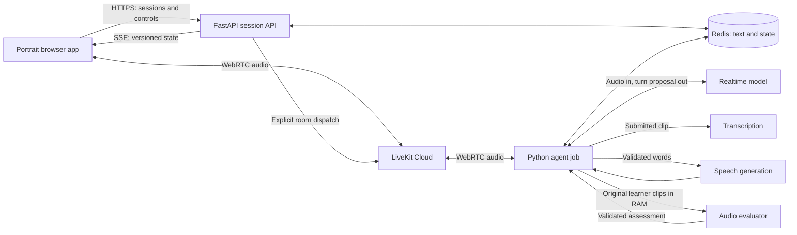
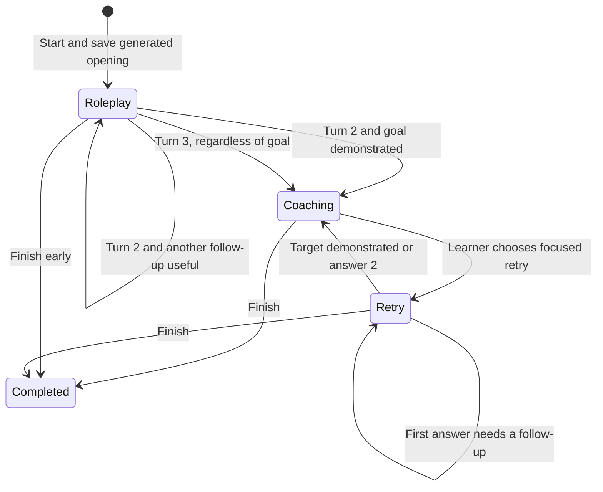

# Workplace English tutor — technical specification

Date: 2026-09-26

Status: technical design draft for review. This document selects a proposed implementation and defines its contracts and verification criteria. No application code, provider configuration, Docker setup, or live model benchmark has been completed as part of this specification.

## 1. Scope and authority

Implement the learning journey in the [product specification](../product/workplace-english-product-spec.md): nine communication purposes, an LLM-generated spoken opening, an answer-dependent exchange of 2–3 learner turns, audio-grounded coaching, optional 1–2-turn focused retries, and temporary guest history. Preserve the single portrait interface and voice-led experience.

The product specification owns learner-visible behavior and assessment anchors. The [assignment](../requirements/general-take-home-project.md) owns delivery requirements. The [domain glossary](../../CONTEXT.md) owns terminology. This technical specification resolves implementation choices; it does not replace these sources or turn the existing mockup into working software.

The design aims for a small, complete take-home submission. It uses one frontend, one Python backend codebase with separate API and agent processes, Redis, LiveKit Cloud, and one model provider. Accounts, a database beyond Redis, durable learner recordings, a job-queue platform, and production autoscaling are outside the first implementation.

### Recommended decisions

| Area | Selection | Reason |
| --- | --- | --- |
| Frontend | React, TypeScript, Vite; LiveKit browser SDK and React components | A client application is sufficient; the existing portrait design does not need server rendering. |
| Backend | Python 3.12, FastAPI, Pydantic, LiveKit Agents 1.8 release family | Typed state and assessment validation, async provider calls, and documented Python voice controls. Lock exact compatible versions during implementation. |
| Media service | LiveKit Cloud; run our agent locally in Docker | Avoid local WebRTC/TURN infrastructure while satisfying the assignment's containerized frontend and backend requirement. Internet access and provider credentials remain necessary. |
| Conversation | OpenAI `gpt-realtime-2`, audio input and text output | Preserve audible context while retaining control over the words published to the learner. |
| Spoken output | OpenAI `gpt-4o-mini-tts`, voice `marin` | Speak validated conversation text, exact expressions, coaching examples, and recovered prompts with one voice. |
| Durable transcript | OpenAI `gpt-4o-mini-transcribe`, per submitted audio segment | Produce an independently identifiable transcript for Redis without making transcript arrival order determine turn order. |
| Exchange assessment | OpenAI `gpt-audio-1.5`, audio input and text/function output | Judge the original learner audio against the four dimensions in a separate bounded request. |
| State | Redis, with atomic transitions and 24-hour activity-based expiry | Restore completed work independently of the browser, LiveKit room, and provider connection. |
| Learner audio | Bounded agent-process RAM only | Support actual audio assessment without saving recordings to Redis, files, or cloud recording storage. |
| Packaging | Four Compose services: `web`, `api`, `agent`, `redis` | One root `.env`, one build/start command, and explicit health checks. |

These are selected defaults, not claims that account access, latency, voice quality, or assessment quality have already been proven. Section 12 defines the checks that must pass before they are accepted for the release.

## 2. Voice architecture and model selection

### Approaches considered

| Approach | Advantages | Costs for this product | Decision |
| --- | --- | --- | --- |
| Realtime audio input → controlled text → TTS, plus audio assessment | Audible input cues; deterministic replay of saved words; a single speech path for roleplay, coaching, and recovery | An extra speech-generation stage; output validation adds latency | **Recommended.** Recovery and exact expression playback are core requirements. |
| Direct speech-to-speech, plus audio assessment | Fewer stages and expressive native audio output | Harder to validate an utterance before it is heard; exact replay requires another path; recovered text history can affect audio output | Retain as an alternative if the selected design fails the voice-quality benchmark. |
| Streaming STT → text LLM → TTS, plus audio assessment | Mature text control and straightforward transcript ownership | The conversation model loses delivery cues; a separate audio evaluator is still needed | Valid fallback architecture, requiring a documented design change and the same acceptance checks. |

LiveKit calls the selected pattern a **half-cascade**. Its current pipeline comparison documents the tradeoffs, and its OpenAI plugin supports text-only model output with a separate TTS provider. The plugin guide also documents an audio-output issue when loading history into a direct realtime model. These are concrete reasons to prefer the half-cascade here. [L1, L2]

### Provider responsibilities

The realtime model interprets the learner's contribution, the communication goal, and the appropriate next utterance. It receives the selected content, saved situation and roles, authoritative phase and turn budget, and the short conversation history. Use low reasoning effort for this bounded conversation; benchmark it rather than assuming a larger reasoning budget improves tutoring. `gpt-realtime-2` supports configurable reasoning and function calling, but does not promise Structured Outputs. [O1]

The transcription model supplies the durable wording. It is not the pronunciation judge. For the initial implementation, transcribe the submitted learner clip through the file-transcription endpoint in parallel with the realtime model's turn proposal. This avoids depending on delayed realtime transcripts for persistence. Disable duplicate provider-native input transcription in the normal path; optional interim captions must not become separate learner turns. The endpoint documents `gpt-4o-mini-transcribe` and WAV input; use its supported JSON response format. Do not request word timestamps that this model/format combination does not supply. [O5]

The TTS model speaks only server-approved text. Use concise, conversational English at a comfortable B1–B2 pace. Roleplay delivery follows the workplace relationship; coaching uses a supportive explanatory tone. Delivery instructions can specify emphasis, pacing, and tone for a modeled expression. `marin` is an initial voice choice recommended in OpenAI's TTS documentation; learner-facing listening tests remain necessary. [L8, O4]

The audio evaluator receives all eligible original-exchange clips together, plus context and their transcript map. It returns formative judgments, evidence, coaching notes, and one retry priority. `gpt-audio-1.5` supports audio input and function calling through Chat Completions, but **does not support guaranteed Structured Outputs**. Request the assessment function, parse its arguments, and validate them with Pydantic. Do not assume `response_format: json_schema` will make this model's output valid. [O2, O3]

Use direct OpenAI credentials for these four roles. LiveKit Cloud provides media and dispatch; this design does not use LiveKit Inference or inherit its provider-retention terms. Model identifiers and voice are configurable in the root `.env`. Do not silently substitute models when access fails.

### Cost and compatibility

Record input/output usage by model, response duration, and assessment retries without recording learner content. Calculate actual cost per completed practice session from dated provider prices; do not estimate a flat cost per minute from text-token prices. The extra transcription pass and repeated assessment audio are deliberate costs of reliable recovery and evidence-based feedback.

Pin Python and JavaScript dependencies in lockfiles and pin container image versions/digests when creating the implementation. Store the selected model identifier, prompt version, rubric version, and content version with each session/result. The checked model pages do not establish an immutable dated snapshot for every selected alias, so do not invent snapshot names. Model changes rerun the voice and assessment checks.

## 3. Components and data flow



The API and agent share a small domain package rather than call each other's internal implementation. Redis is the source of truth. LiveKit events describe transport and speech activity; they do not own product progress.

| Module | Responsibility and interface | Dependencies |
| --- | --- | --- |
| `content` | Read nine versioned purpose definitions; validate scenario order, expressions, roles, and situation constraints | Curated JSON; no model or Redis dependency |
| `sessions` | `create`, `resume`, `apply_command`, `get`, `list`, `delete`; ownership, expiry, idempotency, and state transitions | Redis repository and trusted server clock |
| `conversation` | Apply a validated turn proposal to the current phase and budget; construct phase-specific model context | Typed session/content objects; no browser or SDK types |
| `voice` | LiveKit connection, audio segmentation, provider adaptation, interruption, and playback receipts | LiveKit, OpenAI, session interface |
| `assessment` | Build an evidence manifest, call the audio model, validate results, and generate targeted retry feedback | In-memory clips, typed rubric, provider client |
| `api` | Cookie authentication, request validation, endpoints, SSE, explicit dispatch, and redacted operational errors | Session interface and LiveKit server API |
| Frontend session controller | Render state, own capture/playback, apply immediate local stops, and reconcile versioned server events | API/SSE and browser LiveKit SDK |

Use one active LiveKit `AgentSession` per connected practice session. Roleplay, coaching, and focused retry have separate prompt/context builders and allowed actions inside that job. This is a small phase workflow, not separate deployed services or several agents talking at once. The evaluator is a bounded task and cannot control the microphone, room, or session lifecycle.

Project model context from the canonical session: approved tutor words with their delivery status, accepted learner answers, current phase, and remaining budget. Remove abandoned proposals and canceled questions. On recovery, rebuild this context from Redis; do not load a serialized provider session or pretend a partly played utterance was fully heard. Treat learner speech, transcripts, and quoted examples as task data, never as instructions that can change the rubric, ownership, or turn limits.

Suggested source layout:

```text
frontend/src/{app,features,voice,api}
backend/app/{api,sessions,conversation,voice,assessment,content}
backend/tests/{state,contracts,agent,audio}
content/workplace-english.json
compose.yaml
.env.example
PROMPT.md
README.md
workflow.md
```

## 4. Content, opening generation, and phase flow

### Content schema

Each purpose contains `scenario_id`, `purpose_id`, display order, title, main expression, alternative, explanation, example, hint starter, preset situation, learner role, tutor role, communication goal, difficulty, and allowed small situation variations. Validate exactly three purposes per scenario and the product's scenario order. Curated examples guide learning; they are not prepared conversation responses.

For a new session, the realtime model produces a structured `OpeningProposal` containing the actual situation, role-consistent setup, and one opening question or prompt. Save the validated proposal before speaking it. Practice again passes the earlier opening as variation context and requests different wording or a small permitted situation change. If the new opening is an exact normalized duplicate, retry generation once; a repeated failure is visible and retryable, not replaced with a prepared successful opening. No global uniqueness database is needed.

Resume uses the saved situation and question. It does not call opening generation again.

### Normal phase flow



Pause is a lifecycle overlay that preserves the current phase; it is not a new roleplay phase. Completing roleplay does not complete the practice session.

### Turn proposal and commit

1. Allocate a server-side `input_id` for the current capture buffer. Automatic completion and **I'm done** compete to seal that same buffer; only one can win.
2. Seal the learner-only audio segment. Start transcription and request a realtime-model `TurnProposal`. Disable automatic unconstrained spoken responses: the proposal must pass the controller before TTS receives text.
3. The proposal describes `contribution_kind` (`answer`, `help`, `coaching_question`, `unusable`), `relation` (`new_answer`, `continuation`), contextual goal/target judgment, acknowledgment, and the proposed next action and words. The server supplies permissible reference IDs; the model cannot create session IDs, turn numbers, epochs, or ownership facts.
4. For an answer, wait for the final transcription result or an explicit unclear-speech result. A provider failure is a retryable pending submission, not fabricated wording. Validate the proposal against the phase and the prospective count, then atomically save the accepted answer, transcript status, next prompt/phase, and response record.
5. Only after that commit may the tutor acknowledge the answer aloud. The frontend shows a submission as saved only after the matching receipt. A browser loss before receipt is reconciled by `input_id`, never by assuming the answer was lost or accepted.
6. Publish the approved text through TTS, with a new `playback_id`. Record whether playback completed, was interrupted, or failed. Generated words and words confirmed played are distinct facts.

The LLM decides whether a contribution answers the question or is a request for help; code does not use keywords or phrase matching to make that judgment. Silence and technical corruption can be rejected before model evaluation. A genuine brief or unclear spoken answer can count while still providing insufficient evidence for one or more scores.

The controller enforces the numeric limits. Before learner turn 2, the normal next action is one follow-up. After turn 2, the model's contextual goal judgment selects a follow-up or coaching. After turn 3, only acknowledgment and a coaching transition are allowed. The structured closing form has no follow-up field. Invalid proposals get one bounded regeneration with the permitted action; they are never spoken first and repaired afterward.

The final roleplay acknowledgment and coaching bridge are short. The visible phase changes with the committed transition; a labeled assessment-pending state is allowed while the score request runs. The first coaching summary reviews useful evidence across the exchange, models an alternative, and identifies one retry priority. Detailed notes retain all distinct meaningful issues rather than only the last learner answer.

Coaching questions stay in coaching. A focused retry has its own ID and 1–2-answer budget, a small situation variation, and the selected target. Its evaluator returns targeted feedback against the original suggestion; it does not replace the original four scores. No automatic success or improvement delta is generated.

## 5. Turn-taking, capture, and playback

### LiveKit and provider integration

Use explicit dispatch with a named agent and metadata containing only `session_id`, `guest_id`, and `connection_epoch`. On job entry, fetch and authorize the Redis snapshot instead of trusting the dispatch metadata as session content. Explicit dispatch and container-hosted agent jobs are documented LiveKit paths. [L6, L7]

Use OpenAI semantic VAD with low eagerness as the initial completion detector. Set automatic response creation off; the application requests a turn proposal after the detected boundary. Semantic VAD considers completion context and is designed to wait longer for unfinished speech. Local speech activity detection remains useful for promptly stopping TTS during a learner interruption. Do not independently run a second automatic commit mechanism that can count the same audio twice. [L2, O6]

The adapter must translate provider input-item IDs and audio boundaries into application `input_id` values. **I'm done** commits the still-open buffer; it is a no-op for an empty or already sealed buffer. It must also suppress a later duplicate provider endpoint event.

LiveKit documents `interrupt`, clearing input, manual commit, and enabling/disabling audio input. Python also documents committing without generating a reply. However, `on_user_turn_completed` is not a universal hook for provider-side realtime VAD: the current node documentation requires agent-side turn detection for that hook. Implement the provider-event adapter explicitly; do not base correctness on an assumed hook invocation. Confirm its mapping against the pinned SDK in the first integration check. [L3, L4]

Disable speculative/preemptive generation and automatic resumption after false interruptions for the initial release. The latest documented defaults can enable these behaviors, which conflicts with this product's careful turn completion and obsolete-speech rules. An intentional stop cannot trigger automatic replay later. [L3, L9]

### Interruptions and premature completion

Speech during tutor playback stops the current output immediately and opens a learner capture buffer. It is eligible learner input, unlike a Pause or Hint fragment. An interrupted tutor message is retained with its delivery status; neither the model nor the UI should claim its full contents were heard.

If completion was detected before the learner finished the same answer, the model can classify the new segment as a continuation of the latest answer. While that tutor response is being generated, played, or interrupted, merge the segments under the same `turn_id`, increment its `answer_revision`, cancel the obsolete response, and recompute the next action. Do not increment the accepted-answer count. Any assessment based on the older exchange revision is rejected.

The transition into coaching remains interruptible. A continuation that interrupts the premature coaching bridge reopens the latest answer and invalidates that provisional transition. Freeze the exchange once the bridge reaches terminal delivery with no continuation being processed: completed playback, or failed playback with output canceled. An explicit Pause, navigation, or Finish can also settle an already committed coaching transition using only accepted answers. Playback failure must not block assessment forever. After freezing, new speech is a coaching question or clarification rather than an additional original roleplay answer. This makes the continuation boundary explicit and testable.

### Control effects

| Control/event | Immediate local effect | Server effect |
| --- | --- | --- |
| Start / Resume | On this user gesture, unlock audio; request microphone access only after the previous session's capture has stopped | Claim the guest's active voice ownership, connect, and continue the saved phase; enable publication only after the claim is confirmed |
| I'm done | Seal the current buffer once; show processing | Submit the same `input_id` used by automatic completion |
| Pause | Stop microphone track, detach/flush playback, discard unsubmitted audio | Save paused lifecycle and phase; invalidate conversation work and output |
| Mute | Stop microphone track and discard the current unsubmitted fragment; leave tutor playback running | Disable input, preserve completed answers and pending tutor output |
| Hint | Stop normal capture/playback; show paused practice | Save pause; generate/play one separately labeled helper utterance; require explicit Resume |
| Hear Alex | Suspend capture and discard an unfinished fragment; play the saved last tutor words | No new conversation turn; restore listening only if it was previously active and the same ownership is still valid |
| Finish | Stop capture and existing conversation playback | Freeze submitted work, mark completed, and create/retain available results and takeaway |
| Back / switch session | Stop capture/playback before navigation | Pause unfinished work; fence the old connection before activating another |
| Disconnect / refresh / background suspension | Stop media and clear partial input as soon as detected | Invalidate the live connection; preserve accepted work; restore unfinished work paused |
| Delete / expiry | Stop media and clear displayed content | Remove session content, terminate its room/job, and reject every later write |

A paused session can play an explicitly requested hint or replay. This is a narrowly scoped playback permission associated with that command; it does not authorize a pending roleplay response. A completed session can play saved feedback/takeaway on request without requesting microphone access. Finish can present its newly requested feedback/takeaway only while that view remains current; nothing may autoplay after navigation.

Connected conversation and replay use LiveKit audio. Expression exploration and completed-session Review use a same-origin streamed HTTP audio response from the same TTS adapter, so they need neither a room connection nor microphone permission. One frontend playback controller owns both transports and cancels either when navigation, another playback request, or a voice session takes ownership. Do not store or cache personalized generated audio.

Capture and playback permissions are checked separately. Show words does not change either. Keep controls usable in connecting, thinking, and assessment-pending states. State labels are text, not animation alone.

## 6. Session state and API contracts

### Durable session record

| Field group | Stored values |
| --- | --- |
| Identity | Server-generated `session_id`, owning `guest_id`, `schema_version` |
| Content | Purpose/content version, actual situation, roles, goal, generated opening, optional source-session ID for Practice again |
| Lifecycle | `in_progress`, `paused`, or `completed`; phase `roleplay`, `coaching`, or `retry`; current substate |
| Ordering | `revision`, `connection_epoch`, `generation_id`, last event sequence, idempotent command receipts |
| Conversation | Current question ID/text; accepted answer IDs and revisions; submitted transcript and reliability state; tutor messages and delivery state |
| Pending work | Sealed input ID and status; response request ID and causal answer revision; assessment request ID and frozen exchange hash |
| Assessment | Four dimension results, evidence, notes, retry priority, model/prompt/rubric versions, availability reasons |
| Retry/takeaway | Retry IDs and completed turns/feedback; reusable expression and reasoning; text needed for playback |
| Recovery | Saved phase, capture preference, text-visibility choice, interrupted-fragment notice, previous delivery status |
| Time | `created_at`, `last_practice_at`, `expires_at`, `completed_at` when applicable |

Audio bytes, base64 audio, provider secrets, and serialized SDK/provider sessions are never fields in this record. An audio-availability marker is advisory and identifies its live worker owner; it cannot make a lost buffer recoverable.

The accepted count is derived from distinct accepted roleplay answer IDs, not from the number of transcript messages, audio chunks, callbacks, or model calls. Retry counts are derived independently.

### Ownership and persistence

Issue a random high-entropy guest identifier in an HttpOnly, SameSite=Lax cookie, authenticated with a server secret. Set Secure on HTTPS. A 30-day browser identifier may outlive session content; it does not extend any session's 24-hour retention. Session IDs are random, and every API operation checks the guest association. Redis and privileged LiveKit credentials are never browser-accessible.

Use one Redis key per session, a guest Recent sessions index, and a guest active-voice lease. Use a shared guest hash tag in key names so related atomic operations can remain in one Redis Cluster slot if sharding is introduced later.

The API and agent call the same atomic transition functions, implemented with Lua or WATCH/MULTI. Each write checks key existence, expiry, owning guest, relevant revision, and operation ID before replacing state. A failed expectation returns the current state or a conflict; it never overwrites it. All mutation paths, including worker results, must preserve the existing absolute expiry unless they represent eligible new practice activity.

Commit operation intent before making a provider call, then conditionally commit its result. Never hold a Redis transaction or state lock across network generation, playback, or assessment. Retried commands return the original receipt and do not renew retention twice. Expiry and Delete take precedence even if the underlying provider request is still running.

Maintain a 15-second active-voice lease, renewed every 5 seconds while the foreground connection is healthy. Lease heartbeats are not practice activity. A connection uses a fresh random epoch; late workers cannot regain ownership. A new session switch fences the previous connection and removes its media participant before allowing the new publisher. If removal/ownership cannot be confirmed, remain connecting with capture off.

Use a browser tab lock where available and BroadcastChannel for immediate cross-tab coordination. Redis ownership and room authorization provide the authoritative check. On a lost control connection, clients fail closed and stop media instead of relying on an indefinitely valid WebRTC connection.

For the take-home, run Redis without RDB snapshots or AOF and without a data volume. This avoids old transcript copies surviving expiry in persistence files. Refresh, browser reconnect, API restart, and agent restart recover while Redis survives. **Redis process/data loss loses temporary history**; explain the unavailable session and offer a fresh start. Stronger infrastructure recovery would require an explicit persistence and deletion policy, not an unmentioned disk backup.

### API surface

All session endpoints are same-origin and cookie-authenticated. Validate Origin on mutations. Use typed errors and `Cache-Control: no-store` for session content. No learner answer is uploaded through a generic public HTTP audio endpoint.

| Endpoint | Contract |
| --- | --- |
| `GET /api/content` | Return the nine curated purpose definitions and content version |
| `POST /api/guest` | Establish browser identity; no microphone or practice session |
| `GET /api/sessions` | List owned, unexpired sessions; clean stale index entries without renewing retention |
| `POST /api/sessions` | Create from a purpose and optional prior session for Practice again; idempotency key prevents duplicate starts |
| `GET /api/sessions/{id}` | Return snapshot, availability, revision, and expiry; no automatic resume |
| `POST /api/sessions/{id}/connect` | Explicit Start/Resume; claim ownership and return a short-lived room-scoped token and current epoch |
| `POST /api/sessions/{id}/commands` | Apply Pause, Resume, Mute, Unmute, I'm done, Hint, Replay, focused retry, Finish, or retry of a failed operation |
| `GET /api/sessions/{id}/events` | SSE with event sequence and full-state resynchronization when needed |
| `POST /api/sessions/{id}/heartbeat` | Renew only the matching voice lease; never renew session retention |
| `POST /api/sessions/{id}/playback` | Authorize playback of a saved tutor message/coaching/takeaway by ID; server resolves the words |
| `DELETE /api/sessions/{id}` | Idempotently remove owned content and fence active work |
| `POST /api/content/{purpose_id}/playback` | Generate audio for a curated expression/example without microphone capture |

Commands include `command_id`, `expected_revision`, and `connection_epoch` when acting on live media. Voice controls reach the agent via a Redis notification, with the saved state as authority; delivery loss is repaired by reading that state. LiveKit RPC may carry a low-latency duplicate notification using the same command ID, not a separate mutation path.

An event includes `session_id`, `revision`, `sequence`, `connection_epoch`, `type`, and a bounded payload. Events are hints to reconcile state; Redis Pub/Sub is not durable history. After SSE reconnect or an event gap, fetch the snapshot. Reject events from other sessions or old epochs. A completed-session review never calls the connect endpoint.

LiveKit tokens grant access only to the server-selected room/identity, subscription to tutor audio, and publication of the microphone. They do not grant room administration or camera/screen publication. Use a five-minute initial token lifetime. Token expiry alone does not terminate an existing or reconnecting participant; explicitly remove/revoke stale participants and use new room/identity epochs during recovery. [L10]

## 7. Audio evidence and assessment

### Audio path and lifetime

Subscribe to the authorized learner microphone track in the agent and obtain PCM frames through LiveKit's raw audio stream interface. Feed the conversation path and an in-memory evidence buffer from this learner source. Never record a mixed room track: tutor speech, expressions, hints, and replays are excluded by source and capture state. Browser echo cancellation is enabled; audible speaker leakage is treated as evidence uncertainty, not confidently attributed to the learner. [L5]

Represent assessment clips as mono PCM16 WAV at 16 kHz with measured sample boundaries. Preserve pauses within an answer; do not remove hesitation, speed up speech, or splice tutor audio into the clip. Attach `turn_id`, `answer_revision`, source-track identity, and capture interval in the manifest. Reference actual turn IDs in the prompt beside their audio inputs.

Initial resource limits are 120 seconds per unsubmitted answer and 16 MiB of PCM evidence per job, sufficient for three such 16 kHz original answers with headroom. These are memory safeguards, not scoring sufficiency thresholds. Warn near a limit; if it is exceeded, stop and ask the learner to retry a shorter answer. Do not silently truncate or count the fragment as completed. Drop completed original audio before collecting later retries once the original assessment succeeds.

Discard unsubmitted fragments immediately on Pause, Mute, Hint, replay, navigation, or loss of capture. Keep accepted original clips only while needed for the original assessment. Free them on successful assessment, Delete, expiry, job shutdown, or after a 60-second assessment retry window. Pausing/leaving frees retained clips; an already running bounded assessment may finish from its in-flight input and save a valid result, but cannot start playback.

Do not use MediaRecorder persistence, IndexedDB audio storage, filesystem temporary WAVs, Redis audio blobs, LiveKit Egress, or provider Files API uploads. WAV encoding and base64 request construction occur in memory. Raw frames elsewhere in SDK histories/caches must be released too. Disable core dumps and do not deliberately use disk-backed audio spooling; host-level swap is an infrastructure property, not a promise of cryptographic memory erasure.

### Assessment input

The request contains the product rubric, purpose/actual situation/roles, the original exchange's tutor context, every accepted original learner turn, transcript reliability, and available learner audio. Ask the evaluator to distinguish learner delivery from noise, prioritize intelligibility over accent imitation, accept normal thinking pauses, and assess meaning rather than exact expression reproduction.

Use `gpt-audio-1.5` with Chat Completions, audio input parts and text/function output, `store=false`, and a single assessment-result function. This is not a text-only Responses request with filenames attached. The audio itself must reach the evaluator. No function may trigger application effects beyond returning assessment data. [O2, O3, O7]

### Result schema

| Field | Rule |
| --- | --- |
| `exchange_id`, `exchange_revision`, `rubric_version` | Must match the frozen request; server attaches authoritative IDs |
| `dimensions` | Exactly `fluency`, `pronunciation`, `naturalness`, `workplace_tone` |
| Per dimension `status` | `scored`, `not_enough_speech`, `audio_unclear`, or `assessment_unavailable` |
| Per dimension `score` | Integer 1–5 only for `scored`; otherwise null |
| Per dimension `basis` | `audio`, `wording`, or `audio_and_wording`; consistent with the available evidence |
| Per dimension `explanation` and `evidence` | A useful explanation and at least one real original-turn reference for each score |
| Evidence entry | Turn ID, evidence kind, observed feature; an optional exact wording quote or measured clip interval |
| `strengths`, `issues` | Evidence-linked observations; each issue includes a concrete suggestion, example, and reason |
| `retry_priority` | One actionable issue or supported refinement/transfer challenge, linked to the notes |
| `spoken_summary`, `modeled_example`, `takeaway` | Short spoken coaching and reusable learning content grounded in the exchange |

The LLM decides whether usable evidence is sufficient for each dimension. Code validates the schema, real evidence IDs, clip bounds, quote provenance, and audio availability. It rejects missing/corrupt audio and structurally unsupported claims about delivery; evaluating the truth of an audible observation remains a model/human-review responsibility. It does not assign scores from words per minute, a minimum duration, a keyword checklist, or hidden per-turn grades.

Transcription remains fallible. Do not instruct STT to correct the learner's grammar or expand unclear words. When the evaluator hears a discrepancy, record uncertainty or an explicitly evidence-linked transcript correction before using that wording in feedback. An STT mismatch is not itself a pronunciation error. Preserve the original transcription and correction provenance; do not silently rewrite the learner's contribution to fit the score.

Fluency and Pronunciation require usable original learner audio. Naturalness can use reliable wording and context. Workplace tone may use wording alone, but the explanation must state that limited basis and cannot claim intonation or warmth of delivery. Silence or isolated acknowledgments cannot produce a fabricated complete scorecard. The four scores are never averaged into an overall grade.

If a model response is malformed or references nonexistent evidence, retry once with the validation errors and the same evidence. Never silently coerce a score, invent a quotation, or ask a text-only model to repair a missing audio judgment. Valid independently supported dimensions may be preserved; failed dimensions remain unavailable. Surface **Not enough speech**, **Audio unclear**, or **Assessment unavailable** accurately.

### Recovery and immutability

Freeze the original exchange only after its final answer/continuation boundary has resolved. Store a hash of its answer IDs, answer revisions, and context. Assessment writes require the same hash and request ID, a still-existing session, and a valid expiry; they do not require the learner to remain on the feedback page.

A successful original score is immutable. A retry of an unavailable assessment may fill missing dimensions from still-available original evidence, but does not overwrite already obtained scores. Focused retry audio belongs to a separate evaluation and can never fill gaps in the original exchange.

If recovery loses any original audio required for a pending holistic audio judgment, leave the affected dimensions unavailable. Do not present a judgment on the remaining clip as though it covered all original audio. Preserve saved scores and reliable wording-based feedback. Offer a fresh speaking exchange through Practice again when a full new assessment is needed; a focused retry remains a targeted coaching activity.

If Finish is pressed before any accepted answer, complete the session with no scores and a clearly labeled expression reminder, without claiming achievement. If accepted work exists, Finish freezes only that work, permits bounded assessment/result completion, and preserves any available feedback. A partial in-progress answer is excluded.

## 8. Recovery, cancellation, and retention

### Two kinds of cancellation

**Conversation work** is fenced by connection epoch, generation ID, and the causal answer revision. Pause, navigation, session switch, interruption, or deletion invalidate its right to publish speech. Abort the provider/TTS request when possible and reject late chunks/results even when upstream cancellation arrives too late. Check the fence before committing a response and before publishing each audio batch.

**Assessment work** is fenced by session existence/expiry, request ID, and frozen exchange hash. It can finish while the learner is paused or reviewing another screen, since completed results should be saved. It cannot autoplay, renew retention, revise a different exchange, or recreate a deleted/expired session.

The browser also owns a local playback generation. Any stop action detaches or flushes its audio output immediately, before waiting for the server. A later event cannot attach audio unless its session, connection epoch, and playback ID remain authorized. Clear the server audio queue too; after cancellation, establish a fresh output track if the pinned SDK cannot guarantee that queued frames from the previous generation are discarded. Verify this rather than assuming a canceled HTTP request flushes WebRTC playback.

### Recovery table

| Saved condition | Recovery behavior |
| --- | --- |
| Capturing an unfinished answer | Discard the fragment; show the same current prompt and accepted count, paused |
| Sealed input without accepted receipt | Reconcile by input ID; finish its commit if a live owner still has the evidence, otherwise report it was not saved and repeat the prompt |
| Accepted answer, no committed tutor reply | Keep the answer; explicitly resume/retry generation once from saved context and the same response operation |
| Tutor reply committed, playback incomplete | Preserve its words and interrupted/unknown delivery state; offer/replay those words on explicit Resume without generating a new question |
| Assessment pending, original audio still owned | Allow bounded assessment completion or an explicit retry |
| Assessment pending, audio lost | Preserve completed text/work and saved dimensions; mark unsupported pending audio judgments unavailable |
| Coaching/retry paused | Restore that phase and its current question/target; do not restart roleplay |
| Completed | Read-only review with optional audio playback; Practice again creates another session |
| Deleted/expired/missing Redis data | Return an unavailable-session screen and fresh-start action; never recover fabricated history |

Treat LiveKit reconnecting/disconnected events, SSE loss, page unload, and mobile background suspension as reasons to stop capture/playback. Unload delivery is best effort; lease expiry and worker disconnect detection repair missed pause commands. A snapshot of an unfinished session with no valid live owner is normalized to paused before Resume is offered. No automatic microphone reacquisition occurs.

### Expiry algorithm

`expires_at = last_practice_at + 24 hours`, using the server clock. Eligible activity is starting/resuming practice, accepting a learner contribution, requesting active help/coaching/retry, and the first successful Finish. Replay of a saved completed result, reading, listing, passive media/lease heartbeats, and background model completion do not renew the interval. A replay used as active practice help can renew it only while the session is unfinished.

Set Redis expiry from the same absolute timestamp on all session-owned data. Recent sessions entries are indexed by activity and carry expiry; filter missing or expired records and prune stale index entries on reads. Redis expiry plus a periodic sweeper releases active rooms/work and stale references. Every read/write checks `expires_at` as well, so correctness does not depend on keyspace notifications or sweeper timing.

Delete atomically removes the session and Recent sessions reference, fences its active connection, and cancels work. A result writer uses update-if-present semantics; it never creates a missing key. No content-bearing tombstone is needed. Unknown/foreign IDs do not reveal whether another guest's session exists. An owned stale reference may explain expiry; all other unavailable IDs use a neutral message.

## 9. Browser behavior and failure budgets

### Supported environment

Release verification targets current stable Chrome and Edge on desktop, Chrome on Android, and Safari on iOS, with exact tested versions recorded in the README. Other browsers receive capability-based microphone/audio errors rather than an invented connected state. Physical-device testing is required; responsive desktop emulation is insufficient for microphone permission and audio-unlock behavior.

Serve through HTTPS for physical phones. `http://localhost:8080` is the documented local-desktop path; a phone accessing an HTTP LAN IP does not get the same secure-context treatment. For a phone demo, use a trusted HTTPS reverse proxy/tunnel to the Compose web service, configure `APP_ORIGIN` and secure cookies, and verify WebRTC connectivity from that phone. This is optional network setup around the same containers, not a separate app implementation.

Compute the app bounds as `width = min(390px, available_width, available_height * 390 / 844)` and `height = width * 844 / 390`, using the dynamic viewport and accounting for outer insets. Reflow/scroll inside these bounds. Do not scale the whole DOM with a transform: type and controls retain readable sizes and at least 44×44 CSS-pixel targets. Test the 390×844 reference, a 375×667 host, a narrow phone, and a wide desktop.

### Initial measurable targets

These are release targets to measure, not observed results. Measure on a stable broadband connection from the actual demo region, with a warmed agent and cached assets; report cold-start numbers separately.

| Measurement | Target / action |
| --- | --- |
| Start click to first audible generated opening, excluding human permission delay | p95 ≤ 8 seconds; connection attempt fails visibly at 15 seconds |
| Detected completed answer to first audible substantive response | p50 ≤ 1.8 seconds, p95 ≤ 3.5 seconds over at least 30 replies |
| Last speech frame to reply for clearly finished audio samples | p95 ≤ 5 seconds; measure endpointing separately from generation |
| Pause/Mute/Finish local capture stop | ≤ 150 ms after the control event |
| Intentional barge-in to tutor silence | p95 ≤ 300 ms; no later resumption of obsolete audio |
| Feedback after the final answer | Short acknowledgment/bridge within reply budget; full assessment p95 ≤ 12 seconds |
| Assessment request | 30-second total deadline including at most one retry; visible unavailable state afterward |
| Transcription / turn proposal / TTS start | 8-second deadline per operation; no hidden indefinite SDK retries |
| Explicit Resume to restored ready state | p95 ≤ 5 seconds, excluding permission dialog |
| Lost connection/ownership | Local stop on detection; server lease repair within 15 seconds |

At 3 seconds without a reply, show truthful processing text. At an operation deadline, expose Retry and exit controls. A partial audible response is never automatically replayed as a whole on a network retry. Upstream request cancellation does not imply that billing stopped; record duplicate/canceled requests in usage metrics.

Thinking-pause tests are separate from latency on clearly finished speech. Do not tune endpointing to cut off normal learner planning just to meet the reply metric. If low-eagerness semantic VAD cannot meet both criteria, adjust the detector/adapter and rerun the same audio set; do not change the interaction to mandatory push-to-talk.

| Failure | Required technical response |
| --- | --- |
| Microphone denied/missing | Do not connect as listening; explain access retry and offer expression exploration |
| LiveKit/agent unavailable | Timeout connection, release ownership, preserve session, offer reconnect |
| OpenAI auth/quota/model error | Redacted actionable error; no model substitution, scripted answer, or fabricated score |
| Transcription unavailable | Keep a sealed input pending while RAM exists; retry that operation, or ask to repeat after evidence is lost |
| Invalid/failed turn proposal | Preserve accepted work; retry the same causal operation without double-counting |
| TTS or browser autoplay failure | Retain generated words; mark delivery failed and offer explicit replay/audio unlock |
| Redis unavailable | Stop accepting/acknowledging new answers; pause media because state cannot be safely saved |
| Assessment timeout/invalid output | Preserve exchange and valid feedback; show affected unavailable dimensions and retry only with original evidence |

## 10. Docker and configuration contract

### Compose topology

| Service | Packaging and role | Exposure / health |
| --- | --- | --- |
| `web` | Multi-stage Node 22 build of the frontend; Nginx serves static assets and proxies `/api` including SSE without buffering | Host `${APP_PORT}` → container 80; HTTP health path |
| `api` | Python backend image running FastAPI on 8000 | Compose network only; liveness and readiness that checks Redis and agent availability |
| `agent` | Same Python image, separate LiveKit agent-server command in non-development mode | Outbound connections to LiveKit/OpenAI; private SDK health endpoint, normally 8081 [L7] |
| `redis` | Pinned Redis 7.4 image, snapshots/AOF disabled, bounded memory with `noeviction` | Compose network only; `redis-cli ping`; no host port or persistent volume |

The agent registers with LiveKit Cloud; it is not deployed to LiveKit's agent-hosting platform for this release. The browser connects directly to the Cloud media endpoint while API/SSE traffic goes through the local web service. Do not add a second, accidental LiveKit-server Redis dependency or imply that Compose starts external provider infrastructure.

Read configuration from the root `.env` through Compose's explicit environment mapping. Inject only the values each service needs. Secrets never become Vite variables, build arguments, frontend assets, logs, or git content. Frontend API URLs are relative; the API returns the public LiveKit URL and a scoped token at connection time. All session/TTS HTTP responses disable caching; Redis is not a public service.

### Required `.env.example` contents at implementation

The following is the configuration contract, not a populated credential file. Empty secrets fail startup validation with their variable names, never their values.

```dotenv
APP_PORT=8080
APP_ORIGIN=http://localhost:8080
COOKIE_SECURE=false
GUEST_COOKIE_SECRET=
LIVEKIT_URL=
LIVEKIT_API_KEY=
LIVEKIT_API_SECRET=
LIVEKIT_AGENT_NAME=workplace-english-tutor
OPENAI_API_KEY=
REALTIME_MODEL=gpt-realtime-2
TRANSCRIPTION_MODEL=gpt-4o-mini-transcribe
ASSESSMENT_MODEL=gpt-audio-1.5
TTS_MODEL=gpt-4o-mini-tts
TTS_VOICE=marin
REDIS_URL=redis://redis:6379/0
SESSION_TTL_SECONDS=86400
VOICE_LEASE_SECONDS=15
MAX_ACTIVE_SESSIONS=4
ASSESSMENT_TIMEOUT_SECONDS=30
LOG_LEVEL=INFO
```

Validate the retention setting so it cannot exceed 86,400 seconds. Product turn limits and rubric anchors are versioned domain rules, not environment knobs. Default privacy settings always disable recordings and payload logs; do not introduce an undocumented switch that retains learner audio.

The README must document generating a random guest-cookie secret, obtaining LiveKit/OpenAI credentials, required model access and billing, and the startup command:

```sh
docker compose up --build
```

Health probes do not incur model calls. Agent availability means a fresh worker heartbeat after successful LiveKit registration and local initialization, not just an open health-check port. A separate documented preflight command in the backend image verifies the configured provider operations using non-personal fixture content, identifies unsupported model/options, and prints redacted results. Record that it makes billable test calls. Credentials alone are not proof that all four model roles are enabled.

Build dependencies and necessary local model assets into the image. Use lockfile-based installation, non-root application processes, `.dockerignore` entries for `.env`/`.git`/unrelated design artifacts, and no startup dependency installation. Configure a bounded shutdown grace period: fence new work, mark owned sessions paused, stop media, finish/cancel bounded result work, and free audio. API and agent restarts must not rely on local files for session restoration.

### Clean-checkout acceptance

A reviewer copies `.env.example` to `.env`, supplies credentials/secret, and runs Compose without installing Python, Node, Redis, or the LiveKit CLI on the host. The app serves on the documented port and performs a real conversation and real audio assessment. Document optional phone HTTPS setup separately. Missing credentials produce a clear setup error, never a simulated connected experience.

## 11. Data handling and operational visibility

| Processor/store | Data sent or held | Policy for this implementation |
| --- | --- | --- |
| Browser | Live mic frames, transient playback, rendered transcript/results, guest cookie | No learner recording persistence; stop tracks explicitly; no session-content localStorage/IndexedDB cache |
| Agent RAM | Learner clips, provider context, in-flight assessment | Bounded lifetime from section 7; clear buffers and SDK contexts on completion/cancellation |
| Redis | Session text, scores, evidence descriptions, timestamps, access/ordering state | Activity-based expiry ≤ 24 hours; no disk persistence in take-home configuration |
| LiveKit Cloud | Live media transport and connection metadata | No Egress; `AgentSession.start(record=False)` to disable audio/transcript/trace/log collection for each session; document Cloud project setting too [L11] |
| OpenAI Realtime | Live learner audio, context, model turn proposals | Direct API processing; do not promise the application's 24-hour policy applies to provider systems |
| OpenAI transcription | Submitted learner audio clips | The checked data-controls table lists no abuse-monitoring or application-state retention for `/v1/audio/transcriptions` [O7] |
| OpenAI Chat Completions | Original learner audio/context for assessment and targeted retry evaluation | `store=false`, text/function output only; default abuse-monitoring rules still apply [O7] |
| OpenAI speech endpoint | Approved tutor/coaching/example text | Provider processing under its speech-endpoint data policy [O7] |

OpenAI's checked policy says API data is not used for training unless opted in; default abuse-monitoring retention for Realtime, Chat Completions, and speech generation is up to 30 days, subject to stated exceptions. `store=false` does not mean Zero Data Retention. ZDR requires eligibility/approval and is not assumed. Chat Completions audio output can create one-hour application state; this design asks that endpoint for text/function output, while using the speech endpoint for spoken delivery. [O7]

LiveKit's current observability documentation says collection may include local recordings uploaded after the session and a 30-day Cloud retention window. Explicitly passing `record=False` is necessary; merely avoiding an Egress call is insufficient. Verify the SDK produces no local recording or session-report files and uploads no content telemetry with the chosen configuration. Do not copy tutorial transcript-printing examples into application logs. [L11, L12]

Before microphone use, show a short disclosure that speech is processed by LiveKit/OpenAI, application history is temporary, and the tutor voice is AI-generated. Link to a concise provider/data explanation. Delete removes application-held session content and stops live work; it does not claim to delete external providers' retained data.

Log only operation IDs, phase, error category, timing, numeric usage, and counters. Never log raw prompts, transcripts, tool arguments containing speech, base64, provider tokens, cookie values, or full session reports. Redact SDK/HTTP exception bodies. Retain no user-content analytics in the take-home. Track active jobs, model errors, timeouts, lease loss, rejected stale writes, and assessment availability to diagnose behavior.

## 12. Verification and release gates

### First integration gate

Before building all screens, demonstrate one real purpose through the selected stack: generated opening → two spoken learner answers → controlled coaching transition → four audio-supported dimensions → Finish → refresh and Review. Also demonstrate a pause during an answer and a barge-in. This is an implementation acceptance gate, not a claim that the prototype already exists.

Verify the exact pinned SDK's semantic-VAD events, application-controlled response creation, text-output/TTS combination, audio boundaries, interruption flushing, and recording opt-out. If an API mapping is unsupported, resolve it in the adapter and update this specification. Do not silently fall back to text-only scoring, direct OpenAI browser transport that bypasses LiveKit, or prepared successful conversations.

### Test layers

| Layer | What it establishes |
| --- | --- |
| Domain tests with a controllable clock and real Redis integration cases | Atomic state transitions, 2/3 and 1/2 budgets, idempotent input/commands, activity expiry, deletion races, ownership, stale-result rejection |
| Provider-contract tests | Audio reaches the evaluator; valid/invalid function outputs; transcript-ID mapping; no unsupported score coercion; deadlines and error mapping |
| LiveKit text debugger / agent tests | Answer-dependent reasoning, phase context, goal judgment, coaching questions, help classification, and supported tool behavior; these do not prove audio quality |
| Real audio integration checks | End detection, barge-in, physical-device playback/capture, TTS delivery, assessment evidence, and recovery boundaries |
| Browser tests | Portrait bounds, navigation, controls, event reordering, local media stops, completed review without capture, and session isolation |
| Clean Compose smoke test | Host-independent startup, actual providers, Redis-backed recovery, redacted failure messages, and no recording files |

### Representative audio set

Create at least 24 short exchange fixtures across the nine purposes, including at least eight human-recorded examples from consenting speakers with varied accents. Synthetic speech can help test noise and delivery controls but cannot be the only pronunciation benchmark. These are explicit test assets with provenance, not retained learner sessions.

Cover clear short answers, longer multi-sentence answers, ordinary 1–3-second thinking pauses, filler/restarts, a deliberately unfinished clause, a completed concise answer, silence, background noise, isolated acknowledgments, intelligible accented speech, a specific unclear sound/stress example, identical wording with different tone, tutor leakage, mid-answer Pause, barge-in, and continuation after premature endpointing.

For turn-taking, run at least ten pause/continuation cases and ten finished-answer/manual-submit cases. Require no double counts, no substantive response during designated ordinary thinking pauses in at least 9/10 cases, and reliable single submission with **I'm done** in all manual-submit cases. Run at least ten intentional interruptions: no obsolete utterance may resume. Measure the latency targets separately.

For assessment, two human reviewers familiar with the rubric annotate per-dimension sufficiency and defensible score ranges before seeing model results. Require all eligible, clear full-evidence fixtures to exercise all four dimensions; all silence/acknowledgment-only fixtures to avoid a fabricated full scorecard; all evidence references to resolve; and no invented audio/quotation claims in the release fixture set. At least 80% of supported dimension judgments should fall within the agreed range, with every larger disagreement reviewed and addressed. These are formative-feedback acceptance checks, not a claim of validated proficiency measurement.

Repeat a representative six-exchange subset three times to inspect instability in availability and score judgments. Fix prompts/model choices when results are inconsistent or unfair to an intelligible accent. For voice delivery, human reviewers listen to real generated roleplay, coaching, and modeled expressions across all purposes; reject rushed, monotonous, mis-stressed, or context-inappropriate examples. Prepared mockup clips cannot satisfy this check.

### Product acceptance mapping

| Product scenario | Verification |
| --- | --- |
| A01 | Browser geometry, readable text, keyboard focus, and ≥44×44 targets at reference/smaller/desktop sizes |
| A02 | Content schema checks for nine purposes, ordered scenarios, audible expressions, and correct practice entry |
| A03 | Live audio conversations: generated opening plus follow-ups that use actual learner details; count learner answers only |
| A04 | Two-answer goal-achieved case closes with acknowledgment/bridge and no outstanding question |
| A05 | Three-answer goal-not-demonstrated case cannot produce a fourth roleplay prompt |
| A06 | Representative pause audio plus repeated/manual I'm done events; one accepted input |
| A07 | Real barge-in and same-answer continuation; obsolete playback canceled and count remains correct |
| A08 | Control matrix tests, including helpers during Pause and no helper audio in evidence |
| A09 | Clear-audio rubric fixtures exercise four separate 1–5 scores and evidence; no aggregate |
| A10 | Insufficient/unclear/noisy fixtures produce dimension-specific availability reasons |
| A11 | Retry ends after one or two answers; feedback cites new evidence; original scores unchanged |
| A12 | Finish with zero/one accepted answers and during capture; no fabricated completion or partial-answer score |
| A13 | Refresh/network loss at each pending-work boundary; snapshot restore paused; no automatic capture or duplicate answer |
| A14 | Provider timeout/auth/quota, TTS failure, autoplay denial, and invalid assessment injections |
| A15 | Controlled-clock expiry and Delete/result races; list/review/heartbeats do not extend retention |
| A16 | Fresh checkout/root `.env`/Compose demonstration plus assignment packaging checklist |
| A17 | Resume roleplay, coaching, and retry with exact saved situation/prompt/count |
| A18 | Review without mic; Practice again uses distinct session/opening and fresh evidence while preserving prior results |
| A19 | Two tabs and two sessions competing for ownership; old room fenced before new capture is authorized |
| A20 | Physical-device listening review of natural rhythm, intonation, role-appropriate tone, and modeled delivery |
| A21 | A fixture with different issues in early and late answers produces both useful notes and one retry priority |

Release gates additionally include a worker restart while Redis survives, Redis loss with honest unavailable history, and log/filesystem inspection for accidental learner recording/transcript copies. Mocks establish deterministic mechanics; only actual model and audio runs establish the voice and assessment behavior.

## 13. Submission and scaling

The implementation must include the assignment verbatim in `PROMPT.md` (verify against the source, not a paraphrase), startup/architecture/tradeoffs in `README.md`, a truthful `workflow.md` identifying tools and model choices actually used, `.env.example`, and a real demonstration video. Package source and `.git` in the submission zip, excluding secrets, dependency caches, and non-consensual recordings. Use explicit demonstration input for the video. This specification does not claim those deliverables already exist.

The README's 10,000-concurrent-session discussion should cover:

- Scale stateless API instances separately from long-lived agent jobs; use managed LiveKit media, warm agent capacity, measured per-job resource usage, and graceful draining. A request-per-second estimate is not an agent concurrency estimate.
- Use shared Redis with high availability, sharding by guest, atomic ownership, capacity planning, and a documented persistence/deletion strategy. Browser recovery and storage disaster recovery remain different guarantees.
- Obtain sufficient realtime connection and model quotas; separately budget transcription, TTS, and bursty end-of-exchange assessments. Apply admission control instead of accepting sessions that cannot receive timely speech.
- Keep audio assessment close to the owning process or use bounded ephemeral transfer. A durable queue of job IDs cannot recover lost audio; persisting recordings to solve that would require a product/data-policy change.
- Bound PCM memory: at the 16 MiB limit, 10,000 simultaneously full evidence buffers alone approach 156 GiB before SDK/model context and process overhead. Measure actual occupancy, release buffers promptly, and distribute jobs accordingly.
- Measure regional RTT, p95 speech latency, assessment availability, costs, and active jobs; scale down only after draining. Keep content-free metrics and evaluate voice quality after provider/model changes.

The first release implements neither a distributed job-queue system nor Kubernetes. Its module boundaries, explicit state ownership, and acceptance checks preserve a path to those changes without adding them to the take-home.

## 14. Sources checked for this draft

Official documentation was consulted on 2026-09-26. Documentation establishes the cited capabilities; it does not replace checking the installed SDK, available model access, or measured behavior.

| Reference | Source and use |
| --- | --- |
| L1 | [LiveKit pipeline types](https://docs.livekit.io/agents/models/pipelines.md): half-cascade, direct realtime, and transcription-pipeline tradeoffs |
| L2 | [LiveKit OpenAI Realtime plugin](https://docs.livekit.io/agents/models/realtime/plugins/openai.md): configuration, semantic VAD, separate TTS, and recovered-history caveat |
| L3 | [LiveKit turns and interruptions](https://docs.livekit.io/agents/logic/turns.md): manual controls, input clearing, and false-interruption behavior |
| L4 | [LiveKit nodes and hooks](https://docs.livekit.io/agents/logic/nodes.md): restrictions on the realtime user-turn-completed hook |
| L5 | [LiveKit raw media tracks](https://docs.livekit.io/transport/media/raw-tracks.md): learner-track PCM frame access |
| L6 | [LiveKit explicit dispatch](https://docs.livekit.io/agents/server/agent-dispatch.md): named agent jobs and metadata |
| L7 | [LiveKit self-hosted agent deployment](https://docs.livekit.io/deploy/custom/deployments.md): Docker, outbound registration, and health endpoint |
| L8 | [LiveKit OpenAI TTS](https://docs.livekit.io/agents/models/tts/openai.md): speech model, voice, and delivery instructions |
| L9 | [LiveKit sessions](https://docs.livekit.io/agents/logic/sessions.md) and [events](https://docs.livekit.io/reference/agents/events.md): lifecycle, transcripts, speculative generation, and errors |
| L10 | [LiveKit tokens and grants](https://docs.livekit.io/frontends/reference/tokens-grants.md): room permissions, reconnect expiry, and revocation |
| L11 | [LiveKit Agent Insights](https://docs.livekit.io/testing/observability/insights.md): recording defaults, `record=False`, and Cloud observability retention |
| L12 | [LiveKit data hooks](https://docs.livekit.io/testing/observability/data.md): session reports and content telemetry |
| O1 | [OpenAI GPT-Realtime-2](https://developers.openai.com/api/docs/models/gpt-realtime-2): audio/text modalities, reasoning, and tool support |
| O2 | [OpenAI GPT-Audio-1.5](https://developers.openai.com/api/docs/models/gpt-audio-1.5): audio input and lack of Structured Outputs support |
| O3 | [OpenAI audio guide](https://developers.openai.com/api/docs/guides/audio): audio Chat Completions implementation path |
| O4 | [OpenAI text-to-speech](https://developers.openai.com/api/docs/guides/text-to-speech): voices and speech generation |
| O5 | [OpenAI transcription API](https://developers.openai.com/api/reference/resources/audio/subresources/transcriptions/methods/create): supported model and WAV input |
| O6 | [OpenAI semantic VAD](https://developers.openai.com/api/docs/guides/realtime-vad#semantic-vad): completion behavior and eagerness |
| O7 | [OpenAI data controls](https://developers.openai.com/api/docs/guides/your-data): endpoint-specific retention, training policy, and `store=false` limitations |
